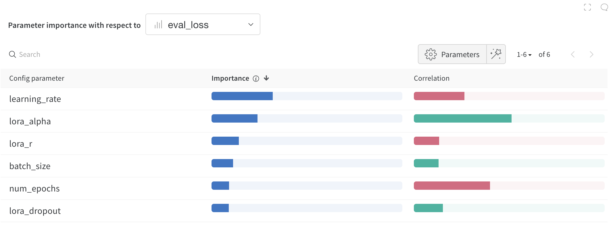

# Llama-2-7B Fine-tuning for ASAP Dataset

This repository contains a script for fine-tuning the Llama-2-7B model on the ASAP dataset for automated essay scoring (AES). The script utilizes the Hugging Face Transformers library and the PEFT (Parameter-Efficient Fine-Tuning) technique to efficiently fine-tune the large language model.

## Recent Updates (2024/04/18)
- Added support for fine-tuning the DeBERTa-v3-large model
- Added support for fine-tuning the Mistral-7B model
- Updated the hyperparameters for Llama-2 fine-tuning based on hyperparameter tuning results

## Features

- Fine-tunes the Llama-2-7B model for sequence classification tasks
- Supports both cross-prompt and prompt-specific datasets
- Implements LORA (Low-Rank Adaptation) for parameter-efficient fine-tuning
- Utilizes 8-bit quantization for memory-efficient training
- Calculates various evaluation metrics including QWK, LWK, Correlation, RMSE, and MAE
- Integrates with Weights and Biases (wandb) for experiment tracking

## Requirements

- Python 3.7+
- PyTorch
- Hugging Face Transformers
- datasets
- scikit-learn
- wandb (optional)

## Usage

1. Install the required dependencies (upcoming):
```
pip install -r requirements.txt
```

2. Prepare your dataset in the appropriate format and directory structure:
   - For cross-prompt datasets: `data/cross_prompt_attributes/{prompt_id}/`
   - For prompt-specific datasets: `data/prompt-specific/{prompt_id}/fold-{fold}/`

3. Run the fine-tuning script with the desired arguments:
```
python train_llama2.py \
    --test_prompt_id 1 \
    --data_dir data/prompt-specific/ \
    --model_name meta-llama/Llama-2-7b-hf \
    --output_dir outputs/llama2-7b \
    --attribute_name score \
    --num_epochs 20 \
    --lr 5e-4 \
    --wandb
```

4. Monitor the training progress and evaluation metrics using the console output or Weights and Biases dashboard.

5. After training, the fine-tuned model and tokenizer will be saved in the specified output directory.

This script also supports evaluation using cross-validation. To perform 5-fold cross-validation for each prompt ID, you can use the provided `cross-validation-llama2.sh` script. This allows for a more robust evaluation of the model's performance across different subsets of the data.

## Arguments

- `--test_prompt_id`: The ID of the test prompt (default: 1)
- `--data_dir`: The directory containing the dataset (default: 'data/prompt-specific/')
- `--fold`: The fold number for prompt-specific datasets (default: 0)
- `--model_name`: The name or path of the pre-trained model (default: 'meta-llama/Llama-2-7b-hf')
- `--output_dir`: The directory to save the fine-tuned model (default: 'outputs/llama2-7b')
- `--attribute_name`: The name of the attribute to predict (default: 'score')
- `--seed`: The random seed for reproducibility (default: 12)
- `--max_seq_length`: The maximum sequence length for tokenization (default: 512)
- `--batch_size`: The batch size for training and evaluation (default: 8)
- `--num_epochs`: The number of training epochs (default: 20)
- `--lr`: The learning rate (default: 5e-4)
- `--logging_steps`: The number of steps between logging (default: 10)
- `--save_model`: Flag to save the fine-tuned model (default: False)
- `--wandb`: Flag to enable Weights and Biases logging (default: False)
- `--pjname`: The name of the Weights and Biases project (default: 'ASAP-AES-llama2-7b')
- `--run_name`: The name of the Weights and Biases run (default: 'llama2-7b')
- `--lora_r`: the parameter of lora_r (default: 32)
- `--lora_alpha`: the parameter of lora_alpha (default: 16)
- `--lora_dropout`: the parameter of lora_dropout (default: 0.1)

## Hyperparameter Tuning
To optimize the performance of the model, we conducted hyperparameter tuning. The hyperparameters explored include:

- Learning rate
- Batch size
- Number of epochs
- LoRA-related parameters (lora_r, lora_alpha, lora_dropout)

We analyzed the importance of each hyperparameter and investigated their impact on the loss function.



Based on these analyses, we selected the optimal combination of hyperparameters to improve the model's performance. The chosen hyperparameters are as follows:

- Learning rate: 5e-4
- Batch size: 8
- Number of epochs: 20
- lora_r: 32
- lora_alpha: 16
- lora_dropout: 0.1

Through hyperparameter tuning, the model's performance significantly improved, achieving higher accuracy in the automated essay scoring task.

## Acknowledgements

This script is built upon the Hugging Face Transformers library and utilizes the PEFT technique for efficient fine-tuning. It also incorporates various evaluation metrics commonly used in automated essay scoring tasks.

## License

This project is licensed under the [MIT License](LICENSE).

Feel free to contribute, report issues, or suggest enhancements!